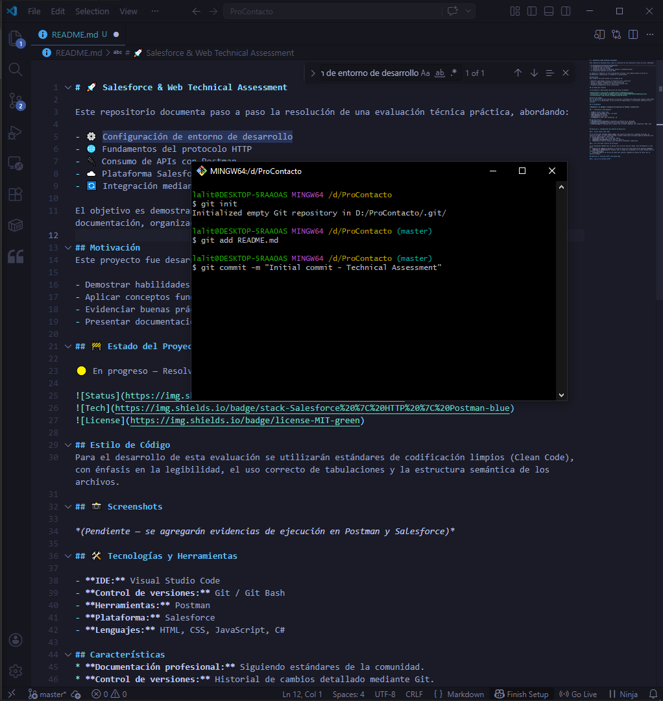

  

# 🚀 Salesforce & Web Technical Assessment

Este repositorio documenta paso a paso la resolución de una evaluación técnica práctica, abordando:

- ⚙️ Configuración de entorno de desarrollo  
- 🌐 Fundamentos del protocolo HTTP  
- 🔌 Consumo de APIs con Postman  
- ☁️ Plataforma Salesforce (Trailhead, objetos y automatizaciones)  
- 🔄 Integración mediante servicios REST  

El objetivo es demostrar no solo conocimientos técnicos, sino también buenas prácticas en documentación, organización y claridad en la comunicación.

## Motivación
Este proyecto fue desarrollado con el propósito de:

- Demostrar habilidades técnicas en desarrollo web y Salesforce  
- Aplicar conceptos fundamentales de arquitectura web  
- Evidenciar buenas prácticas en control de versiones (Git)  
- Presentar documentación clara y profesional  

## 🚧 Estado del Proyecto

🟡 En progreso — Resolviendo ejercicios de forma incremental

## Estilo de Código
Para el desarrollo de esta evaluación se utilizarán estándares de codificación limpios (Clean Code), con énfasis en la legibilidad, el uso correcto de tabulaciones y la estructura semántica de los archivos.

## 📸 Screenshots

*(Pendiente — se agregarán evidencias de ejecución en Postman y Salesforce)*
### 🔹 Primer commit en GitHub

Evidencia de la inicialización del repositorio y control de versiones utilizando Git.

  

## 🛠️ Tecnologías y Herramientas

- **IDE:** Visual Studio Code  
- **Control de versiones:** Git / Git Bash  
- **Herramientas:** Postman  
- **Plataforma:** Salesforce  
- **Lenguajes:** HTML, CSS, JavaScript, C#  

## Características
* **Documentación profesional:** Siguiendo estándares de la comunidad.
* **Control de versiones:** Historial de cambios detallado mediante Git.
* **Versatilidad:** Preparado para trabajar con múltiples lenguajes (C#, JavaScript, HTML, CSS).

## Ejercicio 1: Configuración del Entorno de Desarrollo

### 1. Visual Studio Code (IDE)

Se ha seleccionado **Visual Studio Code** como entorno de desarrollo integrado principal. Su elección se debe a su alta extensibilidad y soporte nativo para una amplia gama de tecnologías que se utiliza habitualmente, tales como:
*   **Frontend:** HTML, CSS, JavaScript, React.
*   **Backend & Herramientas:** C#, Node.js, Next.js.
*   **Entornos:** Soporte integral para terminales integradas y depuración.

### 2. Git y Git Bash (Control de Versiones)

Se ha configurado **Git** para la gestión del ciclo de vida del código. Esta herramienta es vital para:
*   **Control de cambios:** Mantener un historial preciso de cada modificación mediante *commits*.
*   **Respaldo y Colaboración:** Asegurar que el código esté disponible en la nube (GitHub) para su revisión y despliegue.
*   **Terminal Bash:** Se utiliza Git Bash para ejecutar comandos de consola de forma ágil en entornos Windows.

## Ejercicio 2: Protocolo HTTP y Estándares Web

### 1. ¿Qué es un servidor HTTP?

Un servidor HTTP es un sistema encargado de recibir, procesar y responder solicitudes (requests) realizadas por clientes, como navegadores web, utilizando el protocolo HTTP.

Su función principal es servir recursos como páginas web, archivos o APIs.

🔄 Flujo de comunicación:
*   **El cliente envía una petición HTTP**
*   **El servidor procesa la solicitud**
*   **Devuelve una respuesta con datos y un código de estado**

### 🔁 2. ¿Qué son los verbos HTTP?

Los verbos HTTP (o métodos) indican la acción que el cliente desea realizar sobre un recurso.

📌 Métodos más comunes:
*   **GET** → Obtener información
*   **POST** → Enviar o crear datos
*   **PUT** → Actualizar un recurso completo
*   **PATCH** → Actualizar parcialmente
*   **DELETE** → Eliminar un recurso

### 📨 3. ¿Qué es un request y un response en una comunicación HTTP? ¿Qué son los headers?
 
# Request (petición)

📌 Es el mensaje que envía el cliente al servidor. Contiene:
*   **Método HTTP**
*   **URL**
*   **Headers**
*   **Body (opcional)**

# Response (respuesta)

📌 Es la respuesta del servidor. Contiene:
*   **Código de estado**
*   **Headers**
*   **Body (datos)**

# Headers

Son metadatos que acompañan la petición o respuesta.

📌 Ejemplos:
*   **Tipo de contenido**
*   **Autenticación**
*   **Información del cliente**

### 🔗 4. ¿Qué es un queryString?

Es una parte de la URL que permite enviar parámetros al servidor.

*   **"?"** inicia el query
*   **"key=value"** define parámetros
*   **"&"** separa múltiples valores

📌 Ejemplo: "https://api.com/users?name=eduardo&age=25"

### 📊 5. ¿Qué es el responseCode?

Es el código que devuelve el servidor para indicar el resultado de una petición.

📌 Categorías:
*   **100 - 199** → Informativo
*   **200 - 299** → Éxito
*   **300 - 399** → Redirección
*   **400 - 499** → Error del cliente
*   **500 - 599** → Error del servidor

### 📦 6. ¿Cómo se envía la data en GET y POST?

# GET
- Los datos se envían en la URL (queryString)
- Son visibles
- Tienen limitación de tamaño

📌 Ejemplo: "GET /users?name=eduardo"

# POST 
- Los datos se envían en el body
- No son visibles en la URL
- Permiten mayor cantidad de información

### 🌍 7. ¿Qué verbo HTTP utiliza el navegador?

El navegador utiliza principalmente:
* **👉 GET**
 Ya que solicita obtener el contenido de una página web.

 ### 🧾 8. JSON vs XML

 Son formatos utilizados para el intercambio de datos.

# JSON

Formato ligero y ampliamente utilizado:

📌 Ejemplo:
{
  "name": "Eduardo",
  "email": "eduardo@email.com"
}

# XML

Formato más estructurado:

📌 Ejemplo:
<user>
  <name>Eduardo</name>
  <email>eduardo@email.com</email>
</user>

### 🧼 9. ¿Qué es SOAP?

SOAP es un protocolo de comunicación basado en XML.

**Características:**
- Estructura estricta
- Mayor seguridad
- Más pesado
- Utilizado en sistemas empresariales

### 🔥 10. ¿Qué es RESTful?

REST es un estilo arquitectónico para diseñar APIs.

**Características:**
- Usa HTTP
- Basado en recursos (URLs)
- Stateless (sin estado)
- Ligero y flexible

📌 Ejemplos:

* GET /users
* POST /users
* DELETE /users/1

### 🏷️ 11. Headers y Content-Type

# Headers
Los headers en un request proporcionan información adicional al servidor.

# Content-Type
Indica el formato de los datos enviados en el body.

📌 Ejemplos:

* application/json
* application/xml
* multipart/form-data