<p align="center">
  
</p>

# 🚀 Salesforce & Web Technical Assessment

Este repositorio documenta paso a paso la resolución de una evaluación técnica práctica, abordando:

- ⚙️ Configuración de entorno de desarrollo  
- 🌐 Fundamentos del protocolo HTTP  
- 🔌 Consumo de APIs con Postman  
- ☁️ Plataforma Salesforce (Trailhead, objetos y automatizaciones)  
- 🔄 Integración mediante servicios REST  

El objetivo es demostrar no solo conocimientos técnicos, sino también buenas prácticas en documentación, organización y claridad en la comunicación.

## Motivación
Este proyecto fue desarrollado con el propósito de:

- Demostrar habilidades técnicas en desarrollo web y Salesforce  
- Aplicar conceptos fundamentales de arquitectura web  
- Evidenciar buenas prácticas en control de versiones (Git)  
- Presentar documentación clara y profesional  

## 🚧 Estado del Proyecto


## Estilo de Código
Para el desarrollo de esta evaluación se utilizarán estándares de codificación limpios (Clean Code), con énfasis en la legibilidad, el uso correcto de tabulaciones y la estructura semántica de los archivos.

## 📑 Contenido

- [Ejercicio 1 - Configuración del entorno](#ejercicio-1-configuración-del-entorno-de-desarrollo)
- [Ejercicio 2 - HTTP y estándares web](#ejercicio-2-protocolo-http-y-estándares-web)
- [Ejercicio 3 - Consumo de API con Postman](#ejercicio-3-consumo-de-api-con-postman)
- [Ejercicio 4 - Trailhead y Salesforce](#ejercicio-4-trailhead-y-plataforma-salesforce)
- [Ejercicio 5 - Objetos estándar Salesforce](#ejercicio-5-objetos-estándar-de-salesforce-y-relaciones)
- [Ejercicio 6 - Conceptos Salesforce](#ejercicio-6-conceptos-y-soluciones-de-salesforce)
- [Ejercicio 7 - Integración REST con Apex](#ejercicio-7-integración-salesforce-con-servicio-rest)

## 📸 Screenshots

<p align="center">
  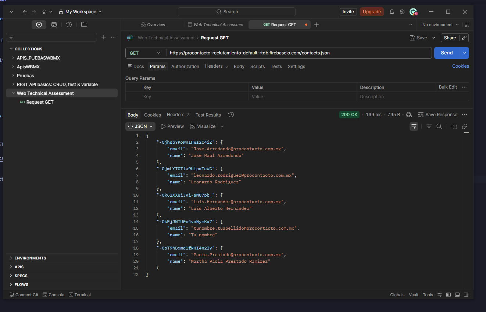
  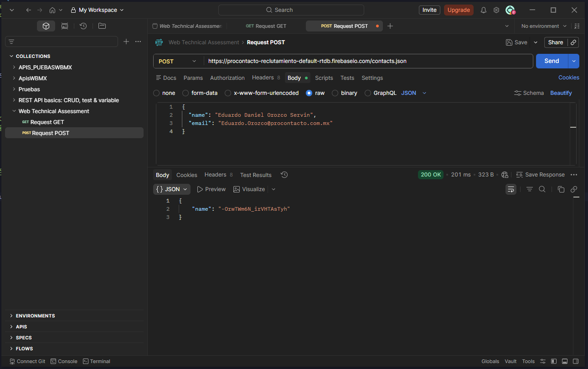
</p>

<p align="center">
  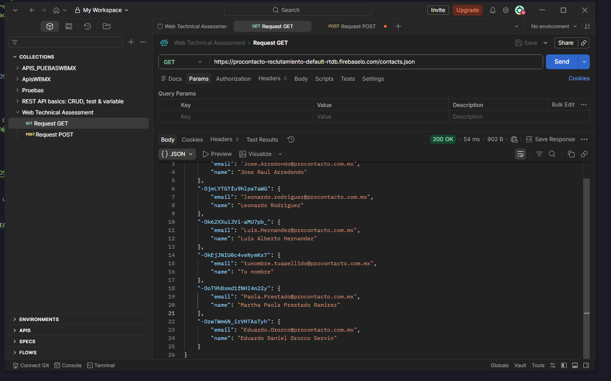
  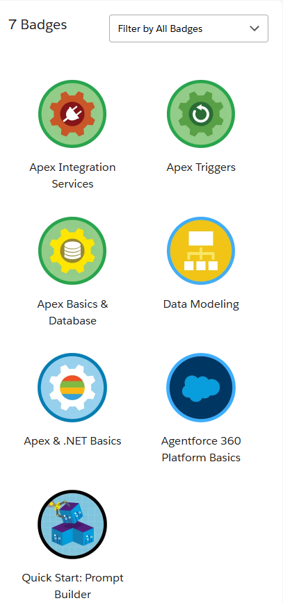
</p>

## 🛠️ Tecnologías y Herramientas

- **IDE:** Visual Studio Code  
- **Control de versiones:** Git / Git Bash  
- **Herramientas:** Postman  
- **Plataforma:** Salesforce  
- **Lenguajes:** HTML, CSS, JavaScript, C#  

## Características
- **Documentación profesional:** Siguiendo estándares de la comunidad.
- **Control de versiones:** Historial de cambios detallado mediante Git.
- **Versatilidad:** Preparado para trabajar con múltiples lenguajes (C#, JavaScript, HTML, CSS).


## Ejercicio 1: Configuración del Entorno de Desarrollo

### 1. Visual Studio Code (IDE)

Se ha seleccionado **Visual Studio Code** como entorno de desarrollo integrado principal. Su elección se debe a su alta extensibilidad y soporte nativo para una amplia gama de tecnologías que se utiliza habitualmente, tales como:
*   **Frontend:** HTML, CSS, JavaScript, React.
*   **Backend & Herramientas:** C#, Node.js, Next.js.
*   **Entornos:** Soporte integral para terminales integradas y depuración.

### 2. Git y Git Bash (Control de Versiones)

Se ha configurado **Git** para la gestión del ciclo de vida del código. Esta herramienta es vital para:
*   **Control de cambios:** Mantener un historial preciso de cada modificación mediante *commits*.
*   **Respaldo y Colaboración:** Asegurar que el código esté disponible en la nube (GitHub) para su revisión y despliegue.
*   **Terminal Bash:** Se utiliza Git Bash para ejecutar comandos de consola de forma ágil en entornos Windows.

## Ejercicio 2: Protocolo HTTP y Estándares Web

### 1. ¿Qué es un servidor HTTP?

Un servidor HTTP es un sistema encargado de recibir, procesar y responder solicitudes (requests) realizadas por clientes, como navegadores web, utilizando el protocolo HTTP.

Su función principal es servir recursos como páginas web, archivos o APIs.

🔄 Flujo de comunicación:
*   **El cliente envía una petición HTTP**
*   **El servidor procesa la solicitud**
*   **Devuelve una respuesta con datos y un código de estado**

### 🔁 2. ¿Qué son los verbos HTTP?

Los verbos HTTP (o métodos) indican la acción que el cliente desea realizar sobre un recurso.

📌 Métodos más comunes:
*   **GET** → Obtener información
*   **POST** → Enviar o crear datos
*   **PUT** → Actualizar un recurso completo
*   **PATCH** → Actualizar parcialmente
*   **DELETE** → Eliminar un recurso

### 📨 3. ¿Qué es un request y un response en una comunicación HTTP? ¿Qué son los headers?
 
#### Request (petición)

📌 Es el mensaje que envía el cliente al servidor. Contiene:
*   **Método HTTP**
*   **URL**
*   **Headers**
*   **Body (opcional)**

#### Response (respuesta)

📌 Es la respuesta del servidor. Contiene:
*   **Código de estado**
*   **Headers**
*   **Body (datos)**

#### Headers

Son metadatos que acompañan la petición o respuesta.

📌 Ejemplos:
*   **Tipo de contenido**
*   **Autenticación**
*   **Información del cliente**

### 🔗 4. ¿Qué es un queryString?

Es una parte de la URL que permite enviar parámetros al servidor.

*   **"?"** inicia el query
*   **"key=value"** define parámetros
*   **"&"** separa múltiples valores

📌 Ejemplo:
https://api.com/users?name=eduardo&age=25

### 📊 5. ¿Qué es el responseCode?

Es el código que devuelve el servidor para indicar el resultado de una petición.

📌 Categorías:
*   **100 - 199** → Informativo
*   **200 - 299** → Éxito
*   **300 - 399** → Redirección
*   **400 - 499** → Error del cliente
*   **500 - 599** → Error del servidor

### 📦 6. ¿Cómo se envía la data en GET y POST?

#### GET
- Los datos se envían en la URL (queryString)
- Son visibles
- Tienen limitación de tamaño

#### POST 
- Los datos se envían en el body
- No son visibles en la URL
- Permiten mayor cantidad de información

### 🌍 7. ¿Qué verbo HTTP utiliza el navegador?

El navegador utiliza principalmente el método:

👉 **GET**

Ya que solicita obtener el contenido de una página web.

### 🧾 8. JSON vs XML

Son formatos utilizados para el intercambio de datos.

#### JSON

Formato ligero y ampliamente utilizado:

📌 Ejemplo:
```json
{
  "name": "Eduardo",
  "email": "eduardo@email.com"
}
```

#### XML

Formato más estructurado:

📌 Ejemplo:

```xml
<user>
  <name>Eduardo</name>
  <email>eduardo@email.com</email>
</user>
```

### 🧼 9. ¿Qué es SOAP?

SOAP es un protocolo de comunicación basado en XML.

**Características:**
- Estructura estricta
- Mayor seguridad
- Más pesado
- Utilizado en sistemas empresariales

### 🔥 10. ¿Qué es RESTful?

REST es un estilo arquitectónico para diseñar APIs.

**Características:**
- Usa HTTP
- Basado en recursos (URLs)
- Stateless (sin estado)
- Ligero y flexible

📌 Ejemplos:

* GET /users
* POST /users
* DELETE /users/1

### 🏷️ 11. Headers y Content-Type

#### Headers
Los headers en un request proporcionan información adicional al servidor.

#### Content-Type
Indica el formato de los datos enviados en el body.

📌 Ejemplos:

- application/json
- application/xml
- multipart/form-data

## Ejercicio 3: Consumo de API con Postman

### 🔹 1. Request GET

Se realizó una petición GET a la siguiente URL:
https://procontacto-reclutamiento-default-rtdb.firebaseio.com/contacts.json

📌 Objetivo:
Obtener la lista de contactos almacenados en el servidor.

📸 Evidencia:


📊 Resultado:
Se obtuvo un objeto JSON con múltiples registros, donde cada contacto está identificado por una clave única generada automáticamente por el servidor.

```json
{
    "-OjhsbYKoWnIHWs2C4iZ": {
        "email": "Jose.Arredondo@procontacto.com.mx",
        "name": "Jose Raul Arredondo"
    },
    "-OjmLYTGTfu9hlpaTaWG": {
        "email": "leonardo.rodriguez@procontacto.com.mx",
        "name": "Leonardo Rodriguez"
    },
    "-Ok62XXuiJVi-aMU7pb_": {
        "email": "Luis.Hernandez@procontacto.com.mx",
        "name": "Luis Alberto Hernandez"
    },
    "-OkEjJNIU0c4veNymKx7": {
        "email": "tunombre.tuapellido@procontacto.com.mx",
        "name": "Tu nombre"
    },
    "-OoT9hBxmd1fNHI4n22y": {
        "email": "Paola.Prestado@procontacto.com.mx",
        "name": "Martha Paola Prestado Ramirez"
    }
}
```

### 🔹 2. Request POST

Se realizó una petición POST a la misma URL para crear un nuevo registro.

📌 Body enviado:
```json
{
  "name": "Eduardo Daniel Orozco Servin",
  "email": "Eduardo.Orozco@procontacto.com.mx"
}
```

📸 Evidencia:


📊 Resultado:
El servidor respondió con un código 200 OK, indicando que la operación fue exitosa y un identificador único generado automáticamente:
```json
{
  "name": "-OrwTwm6n_irVHTAsTyh"
}
```

### 🔹 3. Verificación (GET final)

Se realizó nuevamente una petición GET para validar que el registro fue almacenado correctamente.

📸 Evidencia:


📊 Resultado:
Se observa que el nuevo contacto aparece dentro de la colección con el ID previamente generado:
```json
{
  "-OrwTwm6n_irVHTAsTyh": {
    "email": "Eduardo.Orozco@procontacto.com.mx",
    "name": "Eduardo Daniel Orozco Servin"
  }
}
```

📌 Conclusión:
La API almacena correctamente los datos y asigna identificadores únicos.

#### ¿Qué diferencias se observan entre las llamadas el punto 1 y 3?

La principal diferencia entre ambas llamadas GET radica en el estado de los datos almacenados en el servidor.

- **GET inicial:**  
  Devuelve la lista de contactos existentes antes de realizar cualquier modificación.

- **GET final**  
  Refleja el estado actualizado de la colección después de ejecutar la petición POST.

📌 Diferencia clave:  
En el GET final se observa un nuevo registro que no estaba presente en la primera consulta, el cual incluye un identificador único generado automáticamente por el servidor.

📌 Conclusión:  
Esto demuestra que la operación POST fue exitosa y que los datos fueron persistidos correctamente en la base de datos.

## Ejercicio 4: Trailhead y Plataforma Salesforce

### 🔹 Configuración de Trailhead

Se configuró el entorno de aprendizaje en Trailhead, la plataforma oficial de Salesforce para el desarrollo de habilidades mediante módulos prácticos.

📌 Objetivo:  
Adquirir conocimientos sobre la plataforma Salesforce, su modelo de datos y capacidades de automatización.

### 🔹 Módulos completados

Se completaron los siguientes módulos dentro de Trailhead:

- Fundamentos de la plataforma Salesforce  
- Fundamentos de Apex y .NET  
- Modelado de datos  
- Fundamentos y base de datos de Apex  
- Desencadenadores de Apex  
- Apex Integration Services  

📌 Descripción:
Estos módulos cubren conceptos clave como la estructura de datos en Salesforce, desarrollo en Apex, automatización mediante triggers y la integración con servicios externos.

### 🔹 Evidencia

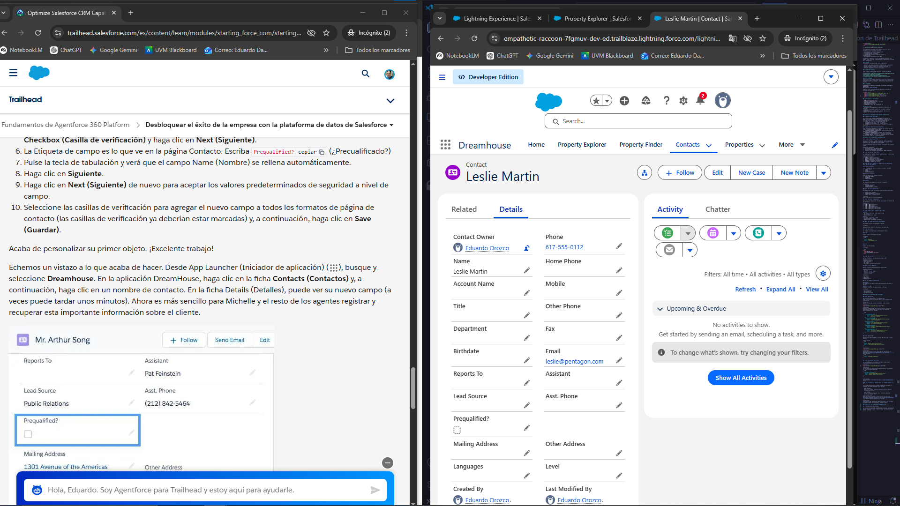
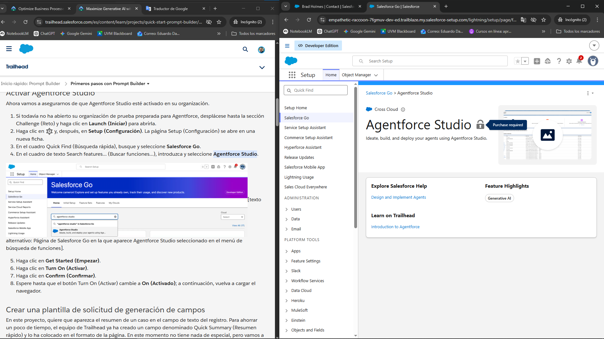
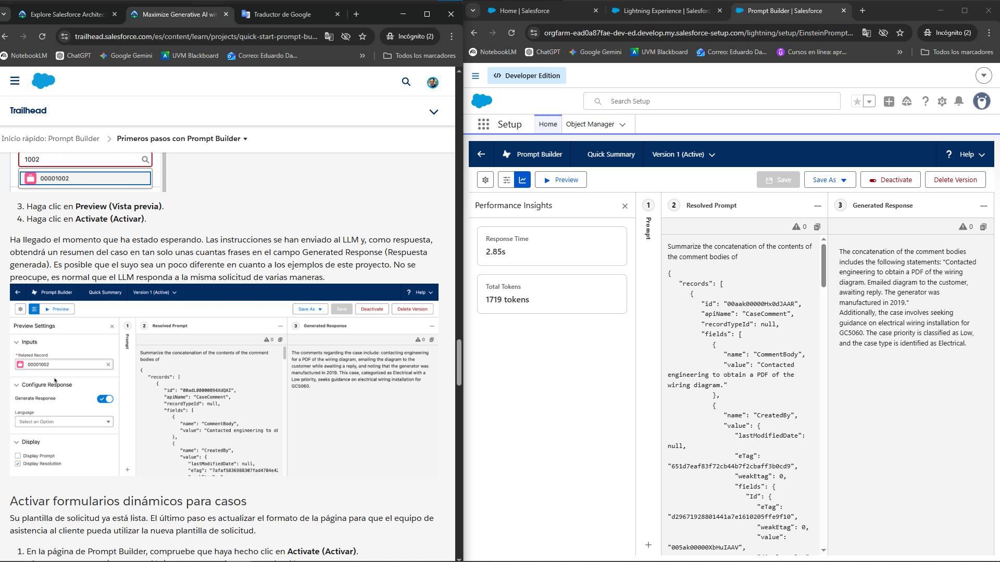
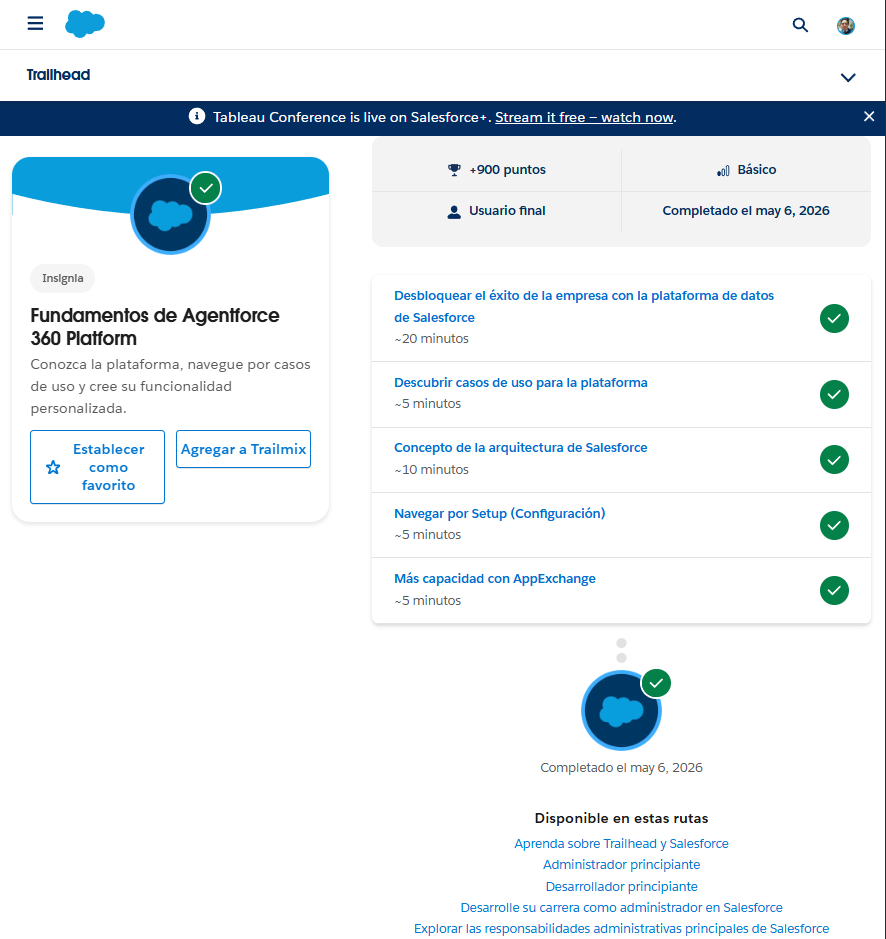
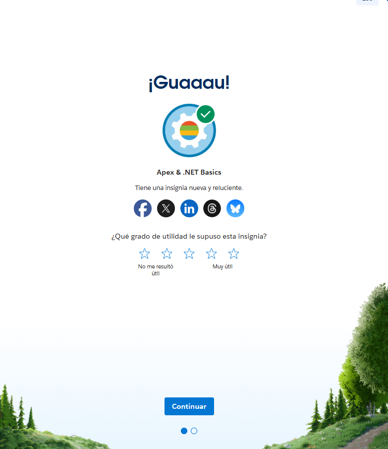
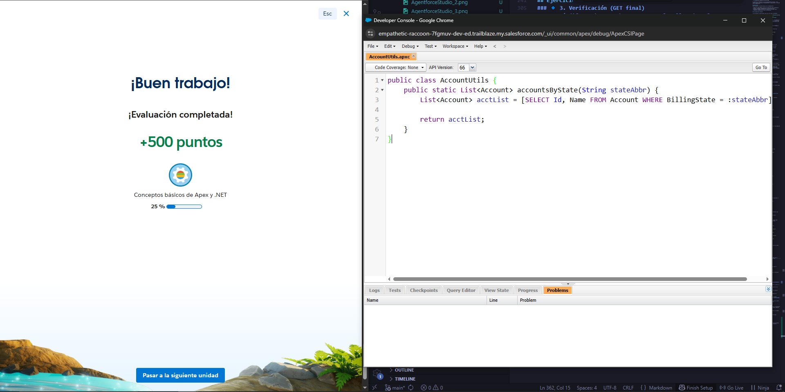
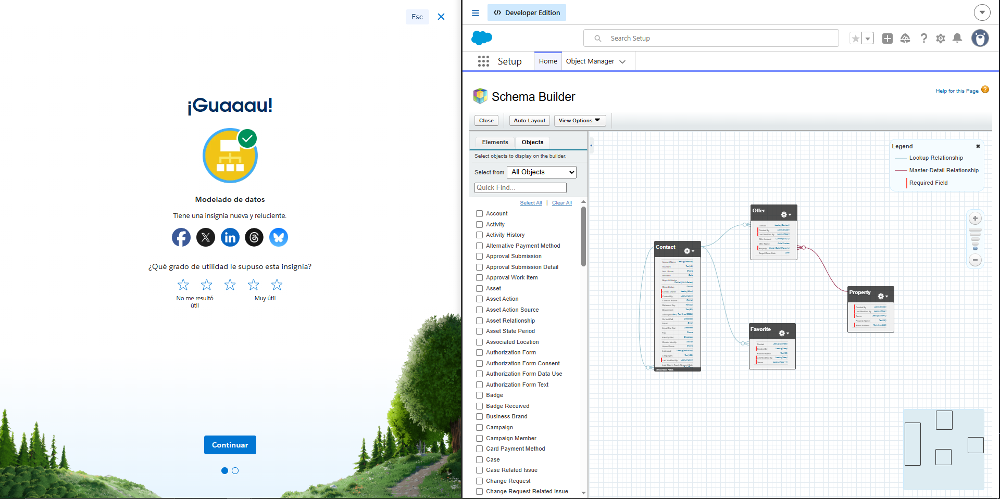
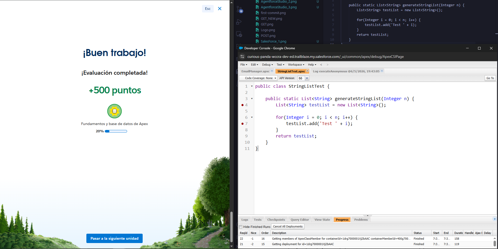
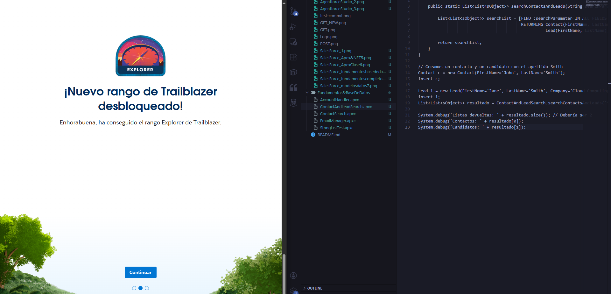


### 🔹 Perfil público

📌 Se comparte el perfil público de Trailhead para validar el progreso:

🔗 [Ver perfil público de Trailhead](https://www.salesforce.com/trailblazer/vyg6rxoavlhws8s4wy)

### 📌 Conclusión

El uso de Trailhead permitió adquirir conocimientos prácticos sobre Salesforce, incluyendo modelado de datos, automatización mediante Apex y consumo de servicios REST.

Además, los módulos completados proporcionaron una base sólida para comprender procesos empresariales, integración de sistemas y desarrollo sobre la plataforma Salesforce.

## Ejercicio 5: Objetos estándar de Salesforce y relaciones

### 🔹 Introducción

Salesforce utiliza objetos estándar para modelar procesos de negocio relacionados con ventas, soporte y atención al cliente.

Cada objeto almacena información específica y se relaciona con otros objetos para construir un ecosistema CRM integral.

## 1. Lead

### 📌 Descripción
Representa un prospecto o posible cliente que todavía no ha sido calificado dentro del proceso comercial.

### 📌 Datos que almacena
- Nombre
- Empresa
- Correo electrónico
- Teléfono
- Estado
- Fuente del Lead

### 📌 Relaciones
- Puede convertirse en:
  - Account
  - Contact
  - Opportunity

## 2. Account

### 📌 Descripción
Representa una empresa, organización o cliente con el que existe una relación comercial.

### 📌 Datos que almacena
- Nombre de la cuenta
- Industria
- Sitio web
- Teléfono
- Dirección
- Tipo de cuenta

### 📌 Relaciones
- Tiene múltiples Contacts
- Tiene múltiples Opportunities
- Tiene múltiples Cases
- Puede tener Assets

## 3. Contact

### 📌 Descripción
Representa una persona asociada a una cuenta o empresa.

### 📌 Datos que almacena
- Nombre
- Apellido
- Email
- Teléfono
- Cargo

### 📌 Relaciones
- Pertenece a una Account
- Puede estar relacionado con Opportunities
- Puede generar Cases

## 4. Opportunity

### 📌 Descripción
Representa una posible venta o negocio en proceso.

### 📌 Datos que almacena
- Nombre de oportunidad
- Monto
- Fecha de cierre
- Etapa de venta
- Probabilidad

### 📌 Relaciones
- Pertenece a una Account
- Puede relacionarse con Contacts
- Utiliza Products
- Puede generar Quotes

## 5. Product

### 📌 Descripción
Representa productos o servicios ofrecidos por la empresa.

### 📌 Datos que almacena
- Nombre del producto
- Código
- Precio
- Descripción
- Estado activo

### 📌 Relaciones
- Se relaciona con PriceBook
- Puede estar en Opportunities
- Puede estar en Quotes

## 6. PriceBook

### 📌 Descripción
Contiene listas de precios para productos.

### 📌 Datos que almacena
- Nombre
- Estado activo
- Lista de productos y precios

### 📌 Relaciones
- Contiene múltiples Products
- Se utiliza en Opportunities y Quotes

## 7. Quote

### 📌 Descripción
Representa una cotización formal enviada a un cliente.

### 📌 Datos que almacena
- Número de cotización
- Fecha
- Estado
- Total

### 📌 Relaciones
- Pertenece a una Opportunity
- Incluye Products

## 8. Asset

### 📌 Descripción
Representa productos que ya fueron vendidos o instalados para un cliente.

### 📌 Datos que almacena
- Nombre
- Número de serie
- Fecha de compra
- Estado

### 📌 Relaciones
- Pertenece a una Account
- Puede relacionarse con Products
- Puede relacionarse con Cases

## 9. Case

### 📌 Descripción
Representa una solicitud de soporte o incidencia reportada por un cliente.

### 📌 Datos que almacena
- Número de caso
- Estado
- Prioridad
- Descripción
- Origen

### 📌 Relaciones
- Pertenece a una Account
- Puede relacionarse con Contact
- Puede relacionarse con Asset
- Puede utilizar Articles

## 🔹 Diagrama UML

El siguiente diagrama representa las relaciones principales entre los objetos estándar de Salesforce:
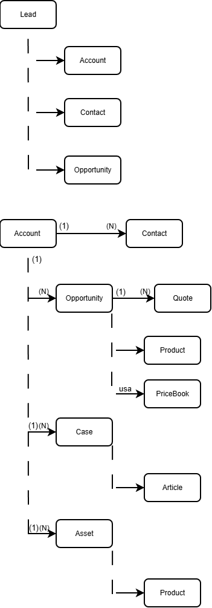

# Ejercicio 6: Conceptos y Soluciones de Salesforce

## 🔹 Soluciones de Salesforce

### A. ¿Qué es Salesforce?
Salesforce es una plataforma CRM (Customer Relationship Management) basada en la nube que permite gestionar procesos comerciales, atención al cliente, automatización, marketing e integraciones empresariales.

### B. ¿Qué es Sales Cloud?
Sales Cloud es la solución de Salesforce enfocada en ventas. Permite gestionar leads, oportunidades, cuentas, contactos y el pipeline comercial.

### C. ¿Qué es Service Cloud?
Service Cloud es la solución orientada al soporte y atención al cliente. Facilita la gestión de casos, automatización de soporte y canales de atención.

### D. ¿Qué es Health Cloud?
Health Cloud es una solución especializada para el sector salud que permite gestionar pacientes, historiales y procesos médicos de forma centralizada.

### E. ¿Qué es Marketing Cloud?
Marketing Cloud es la plataforma de automatización de marketing de Salesforce utilizada para campañas de correo, segmentación y comunicación multicanal.

# 🔹 Funcionalidades de Salesforce

### A. ¿Qué es un RecordType?
Un RecordType permite definir diferentes procesos, layouts y comportamientos para un mismo objeto.

### B. ¿Qué es un ReportType?
Es la estructura utilizada para generar reportes en Salesforce, definiendo qué objetos y campos estarán disponibles.

### C. ¿Qué es un Page Layout?
Es la configuración visual que define cómo se muestran los campos, botones y secciones de un registro.

### D. ¿Qué es un Compact Layout?
Es un diseño compacto que muestra la información más importante de un registro en vistas rápidas y móviles.

### E. ¿Qué es un Perfil?
Un perfil define permisos y accesos de los usuarios dentro de Salesforce.

### F. ¿Qué es un Rol?
Un rol define la jerarquía organizacional y la visibilidad de registros entre usuarios.

### G. ¿Qué es una Validation Rule?
Es una regla que valida datos antes de guardar un registro para garantizar integridad y consistencia.

### H. ¿Qué diferencia hay entre una relación Master Detail y Lookup?
- Master Detail:
  - Relación dependiente
  - Hereda permisos
  - El registro hijo depende del padre

- Lookup:
  - Relación flexible
  - Los objetos pueden existir independientemente

### I. ¿Qué es un Sandbox?
Es un entorno de pruebas de Salesforce utilizado para desarrollo y testing sin afectar producción.

### J. ¿Qué es un ChangeSet?
Es una herramienta utilizada para desplegar configuraciones y desarrollos entre entornos Salesforce.

### K. ¿Para qué sirve el Import Wizard de Salesforce?
Permite importar datos masivamente desde archivos como CSV hacia objetos de Salesforce.

### L. ¿Para qué sirve la funcionalidad Web to Lead?
Permite capturar leads desde formularios web y almacenarlos automáticamente en Salesforce.

### M. ¿Para qué sirve la funcionalidad Web to Case?
Permite crear casos automáticamente desde formularios de soporte web.

### N. ¿Para qué sirve la funcionalidad Omnichannel?
Permite distribuir automáticamente casos, chats o tareas entre agentes disponibles.

### O. ¿Para qué sirve la funcionalidad Chatter?
Chatter es una herramienta de colaboración interna similar a una red social corporativa.

# 🔹 Conceptos Generales

### A. ¿Qué significa SaaS?
SaaS (Software as a Service) es un modelo donde el software se consume desde internet sin instalación local.

### B. ¿Salesforce es SaaS?
Sí. Salesforce es una plataforma SaaS basada en la nube.

### C. ¿Qué significa que una solución sea Cloud?
Significa que la aplicación y los datos se alojan en servidores remotos accesibles mediante internet.

### D. ¿Qué significa que una solución sea On-Premise?
Significa que el software y la infraestructura se alojan localmente dentro de la empresa.

### E. ¿Qué es un pipeline de ventas?
Es la representación de las etapas de un proceso comercial desde un lead hasta el cierre de venta.

### F. ¿Qué es un funnel de ventas?
Es un modelo que representa cómo disminuyen los prospectos en cada etapa del proceso de ventas.

### G. ¿Qué significa Customer Experience?
Es la experiencia total que tiene un cliente al interactuar con una empresa o servicio.

### H. ¿Qué significa omnicanalidad?
Es la integración de múltiples canales de comunicación ofreciendo una experiencia unificada al cliente.

### I. ¿Qué significa que un negocio sea B2B y B2C? ¿Qué es un KPI?
- B2B: negocio de empresa a empresa.
- B2C: negocio de empresa a consumidor final.
- KPI: indicador utilizado para medir desempeño y resultados.

### J. ¿Qué es una API y en qué se diferencia de una REST API?
Una API permite la comunicación entre sistemas.  
Una REST API es un tipo de API que utiliza HTTP y principios REST.

### K. ¿Qué es un Proceso Batch?
Es un proceso automatizado que ejecuta tareas masivas o programadas en segundo plano.

### L. ¿Qué es Kanban?
Kanban es una metodología visual para gestionar tareas y flujos de trabajo.

### M. ¿Qué es un ERP?
ERP (Enterprise Resource Planning) es un sistema utilizado para gestionar procesos empresariales integrados.

### N. ¿Salesforce es un ERP?
No exactamente. Salesforce es principalmente un CRM, aunque puede integrarse con sistemas ERP.

# Ejercicio 7: Integración Salesforce con Servicio REST

## 🔹 Objetivo

Desarrollar una integración entre Salesforce y un servicio REST externo utilizando Apex y triggers.

La funcionalidad consiste en:

1. Obtener un identificador único desde una API REST.
2. Crear un campo personalizado en el objeto Contact.
3. Consumir el servicio REST desde Salesforce.
4. Actualizar automáticamente el correo electrónico del contacto utilizando los datos obtenidos desde la API.

# 🔹 A. Obtención del ID mediante GET en Postman

Se realizó una petición GET al siguiente endpoint:

```http
GET https://procontacto-reclutamiento-default-rtdb.firebaseio.com/contacts.json
```

📌 Objetivo:
Obtener los identificadores únicos de los contactos almacenados en Firebase.

📸 Evidencia:
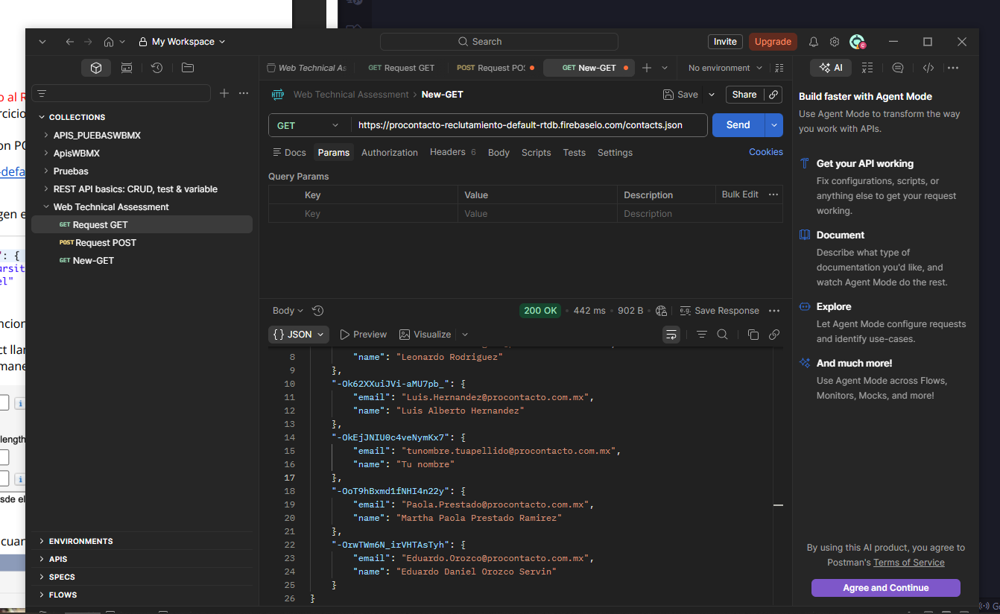

📊 Resultado:
```JSON
{
  "-OrwTwm6n_irVHTAsTyh": {
    "email": "Eduardo.Orozco@procontacto.com.mx",
    "name": "Eduardo Daniel Orozco Servin"
  }
}
```

📌 ID utilizado para pruebas:
-OrwTwm6n_irVHTAsTyh

# 🔹 B. Creación del campo personalizado en Contact

Se creó un campo personalizado en el objeto Contact con las siguientes características:
| Propiedad | Valor            |
| --------- | ---------------- |
| Label     | idprocontacto    |
| API Name  | idprocontacto__c |
| Tipo      | Text             |
| Longitud  | 255              |

📸 Evidencia:
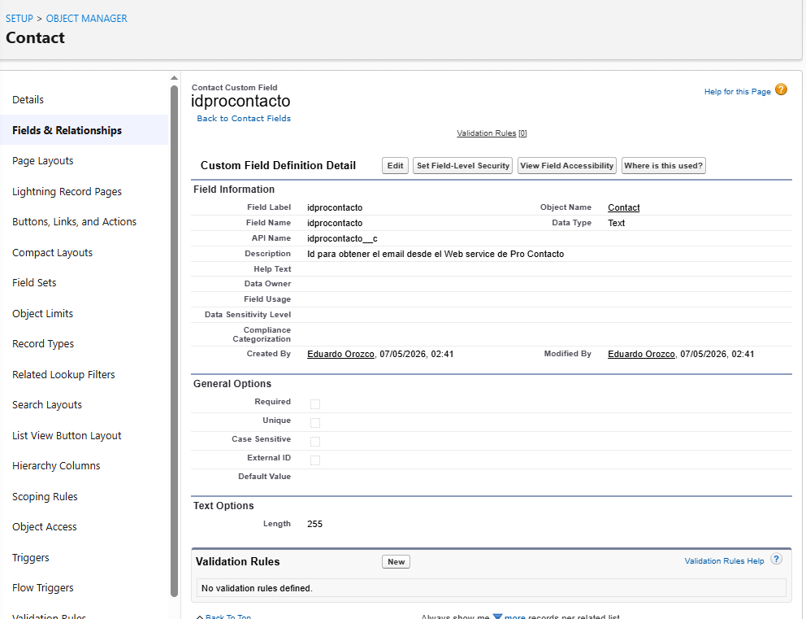

# 🔹 C. Desarrollo del Trigger y Servicio Apex

Para implementar la integración se desarrolló un Trigger sobre el objeto Contact.

## 💻 Código Fuente

El código Apex desarrollado para la integración se encuentra dentro del repositorio:

- `apex/ContactTrigger.trigger`
- `apex/ContactService.cls`

📌 Funcionalidades implementadas:
- Trigger sobre Contact
- Integración REST con Firebase
- Consumo HTTP GET
- Procesamiento JSON
- Actualización automática de Email
- Método asíncrono usando `@future(callout=true)`

 📌 Consideración técnica importante

Los Triggers de Salesforce no pueden realizar llamadas HTTP externas directamente.

Por esta razón, se implementó un método asíncrono utilizando:
@future(callout=true)
Esto permite ejecutar el callout REST en segundo plano cumpliendo las restricciones de la plataforma Salesforce.

📸 Evidencia:
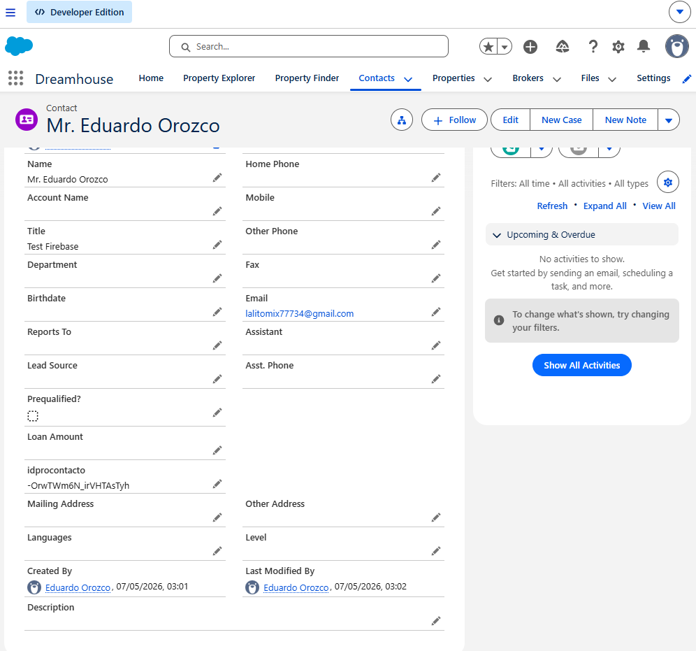
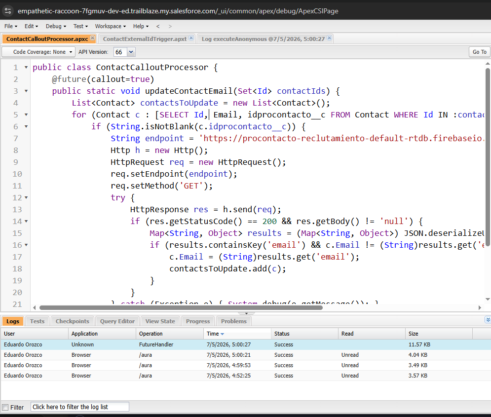
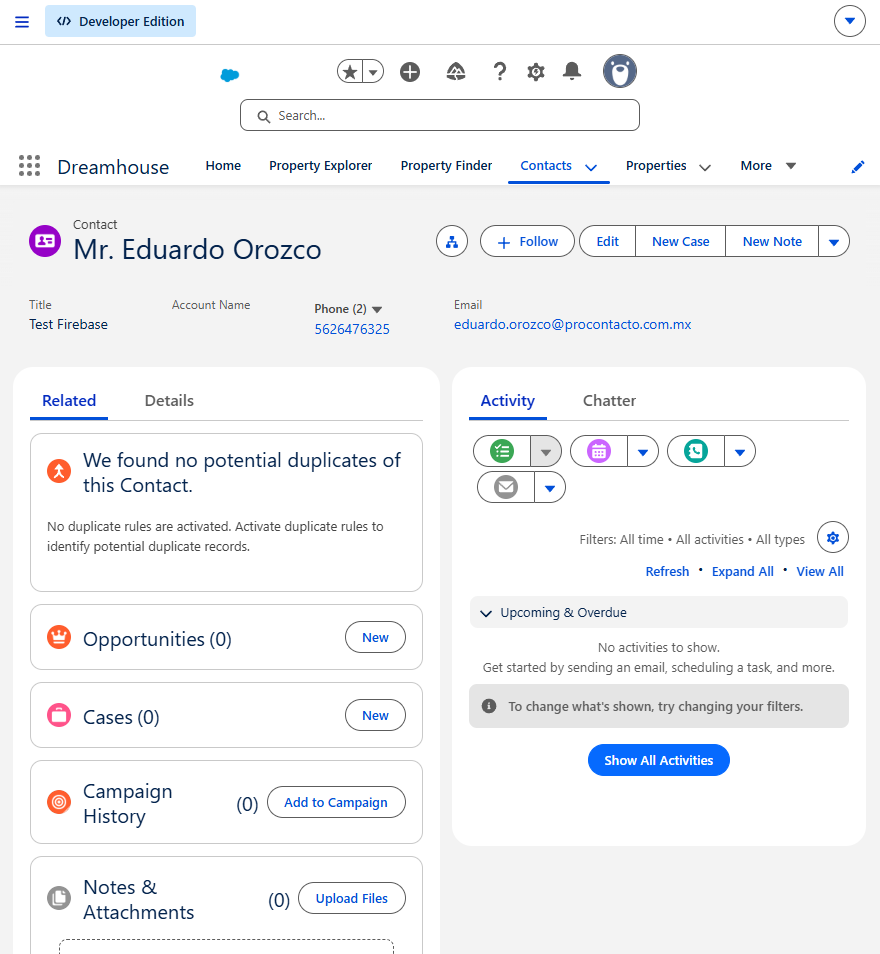

# 📌 Conclusión General

Durante esta evaluación técnica se trabajó con conceptos fundamentales de desarrollo web, consumo de APIs, protocolos HTTP y la plataforma Salesforce.

Además de los conocimientos técnicos, se aplicaron buenas prácticas de documentación, control de versiones e integración entre sistemas mediante servicios REST y Apex.

El proyecto permitió fortalecer habilidades relacionadas con:
- Integración de servicios
- Desarrollo sobre Salesforce
- Modelado de datos
- Automatización mediante Apex
- Consumo de APIs REST
- Documentación técnica profesional

# Créditos

* Pro Contacto: Por el material y la guía de evaluación.
* Salesforce: Documentación oficial y Trailhead.

## 👨‍💻 Autor

Eduardo Daniel Orozco Servin

📌 Tecnologías:
- Salesforce
- Apex
- REST APIs
- Postman
- Git & GitHub
- Desarrollo Web

## 📄 LicenseRESTful

MIT © Eduardo Daniel Orozco Servin